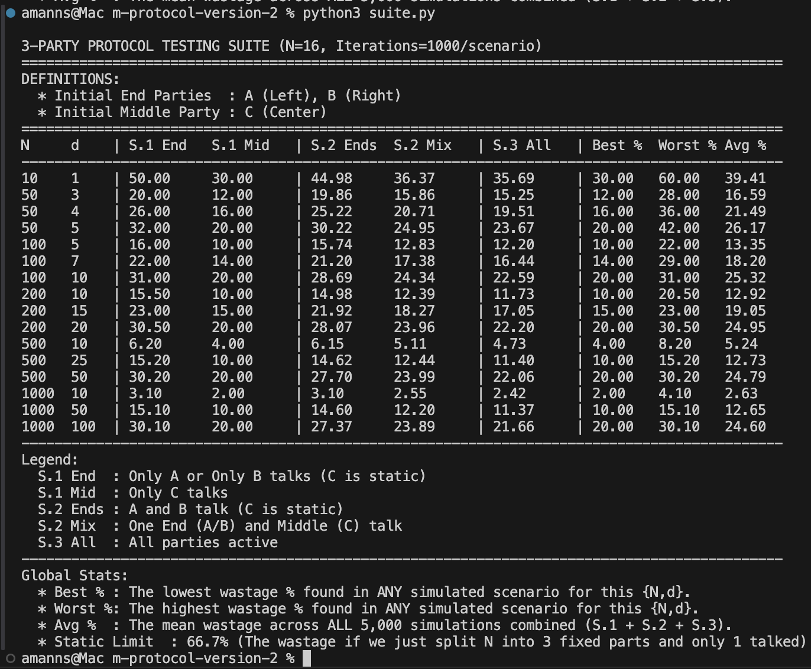

# Dynamic Multi-Party One-Time Pad Protocol

This repository implements **dynamic pad reallocation algorithms** for Multi-Party One-Time Pad (OTP) protocols. The system is designed to secure communication in asynchronous networks while **satisfying perfect secrecy**.

The core research addresses the distributed resource problem where multiple parties must consume shared cryptographic material (pads) from a finite sequence ($N$) without collisions, adapting to non-deterministic execution orders.

## 1. Algorithm Overview

In standard OTP usage, synchronization is trivial between two parties. However, in a multi-party setting (3+ nodes) where execution order is asynchronous, managing pad consumption becomes a complex distributed resource problem.

This implementation proves that perfect secrecy can be maintained through **adaptive resource reallocation**:

1.  **Dynamic Boundaries:** Parties track "Virtual Boundaries" to detect potential collisions before they occur.
2.  **State Reallocation:** If a party's required pad space is threatened by a neighbor, the algorithm shifts consumption ranges to available "whitespace" in the pad array.
3.  **Asynchronous Resilience:** The protocol guarantees correctness regardless of the message delivery order (up to a delay parameter $d$).

### 1.1 Mechanics (3-Party Topology)

The current version implements a **3-Party Linear Topology** (A - C - B) over a shared pad space of size $N$.

* **Pad Space ($N$):** A finite sequence of random pads.
* **Static Ends (A & B):** Consume from the outer edges ($1 \to \dots$ and $N \to \dots$).
* **Dynamic Middle (C):** Consumes from the center but **jumps** to the midpoint of the largest available gap when squeezed, balancing the free space dynamically.

---

## 2. Simulation & Visualizer

A web-based visualizer is included to empirically test the algorithm's efficiency, collision thresholds, and behavior under heavy load.

### 2.1 Running the Simulation

The simulation uses a Python backend for the algorithmic logic and a JavaScript frontend for visualization.

**Prerequisites:** Python 3.x

1.  **Start the API Server:**
    ```bash
    python3 server.py
    ```
2.  **Access the Interface:**
    Open your web browser and navigate to:
    `http://localhost:8000`

### 2.2 Simulation Parameters

* **$N$ (Pad Size):** The total amount of cryptographic material available.
* **$d$ (Delay):** The delay parameter. This simulates the maximum number of undelivered messages in the network. The algorithm requires a buffer of size $d$ to guarantee secrecy.
* **Randomization:** You can toggle "Randomize" to shuffle the execution order within a specific time batch, testing the algorithm's asynchronous resilience.

---

## 3. Project Structure

* `protocol.py`: **The Core.** Contains the `ThreePartyProtocol` class, state management, boundary logic, and reallocation algorithms.
* `server.py`: A lightweight HTTP API bridging the UI and the Python protocol logic.
* `index.html`: The client-side visualizer.
* `testing.py`: A headless CLI tool for running automated batches and stress tests.
* `suite.py`: A stratified Monte Carlo simulation suite for generating statistical performance matrices.

---

## 4. Performance & Evaluation

The protocol was evaluated using **Stratified Monte Carlo** simulations (via `suite.py`), running 1,000 iterations per configuration across varied traffic scenarios.

### 4.1 Summary of Results

**Screenshot of Test Suite Output:**


**Representative Data (Avg Wastage %):**

| N   | d  | S.1 End | S.1 Mid | S.2 Ends | S.2 Mix | S.3 All   | **Global Avg** | **Static Limit** |
|:---:|:--:|:-------:|:-------:|:--------:|:-------:|:---------:|:--------------:|:----------------:|
| 100 | 5  | 16.0%   | 10.0%   | 15.8%    | 12.7%   | **11.9%** | **13.5%**      | 66.7%            |
| 200 | 20 | 30.5%   | 20.0%   | 28.5%    | 24.5%   | **22.2%** | **24.8%**      | 66.7%            |
| 500 | 50 | 30.8%   | 20.0%   | 29.1%    | 24.8%   | **22.5%** | **25.1%**      | 66.7%            |

### 4.2 Scenario Legend

The wastage percentage is highly dependent on *who* is communicating. The protocol performs best when all parties are active (S.3), as the dynamic middle party (C) can actively balance the load.

* **S.1 End:** Only **A** or **B** sends messages (Worst case: C acts as a static wall).
* **S.1 Mid:** Only **C** sends messages (Best case: C expands evenly).
* **S.2 Ends:** **A** and **B** send messages; C is silent.
* **S.2 Mix:** One end party (A/B) and the middle party (C) send messages.
* **S.3 All:** All three parties (**A, B, C**) send messages (Most realistic scenario).
* **Static Limit:** The theoretical wastage (66.7%) of a naive protocol that splits $N$ into 3 fixed segments when only 1 party is active.